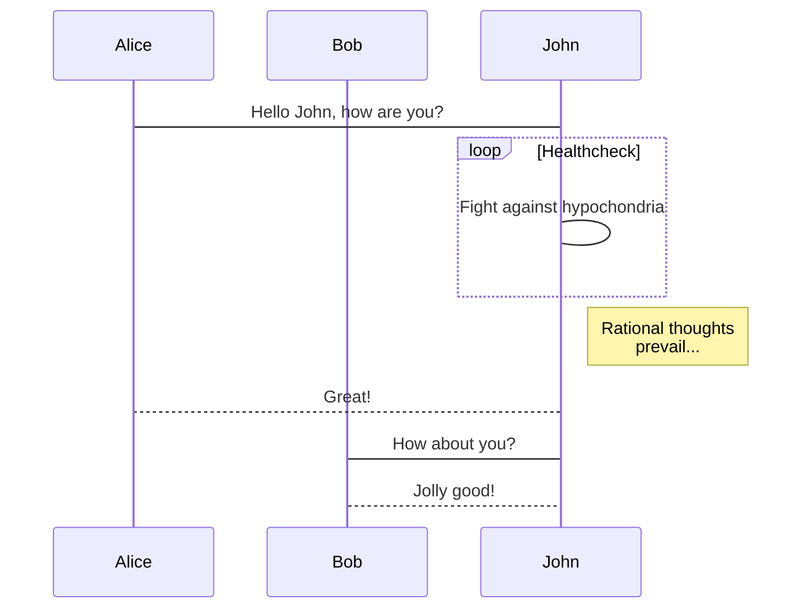
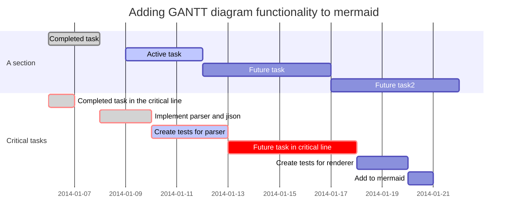
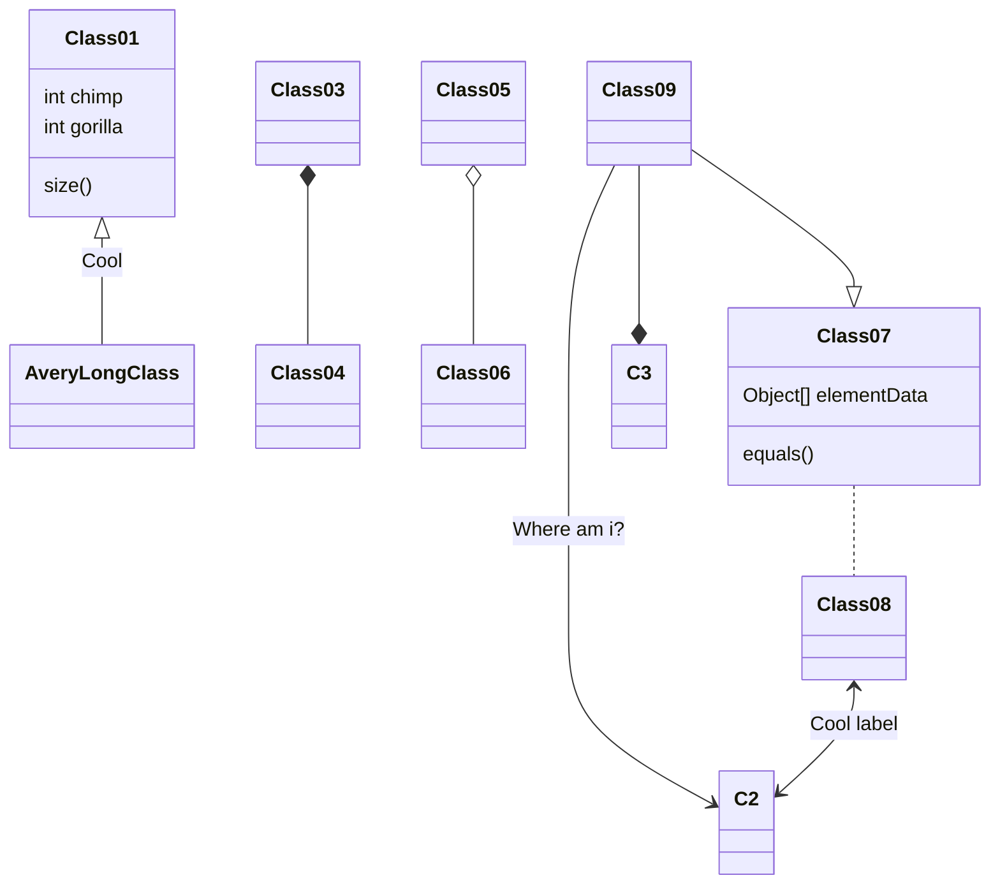

# mermaid demo

<!--[NOWRITING]-->
<link rel="canonical" href="https://wraith13.github.io/writing/?@demo/mermaid.md" />
この markdown の表示用URL: <a rel="canonical" href="https://wraith13.github.io/writing/?@demo/mermaid.md">https://wraith13.github.io/writing/?@demo/mermaid.md</a>
<!--[/NOWRITING]-->

<!--[NOREVEAL/][markdown](?markdown) | [remark](?remark) | [reveal](?reveal)-->
<!--[REVEAL/][markdown](?markdown) | [remark](?remark) | [reveal](?reveal)-->
<!--[REVEAL-THEME] beige -->
<!--[REMARK-CONFIG]
{
    "ratio": "16:9"
}
-->

## official site

<https://mermaidjs.github.io/>

## live editor

<https://mermaidjs.github.io/mermaid-live-editor/>

## flowchart source

~~~

~~~

## flowchart figure

## sequence diagram source

~~~

~~~

## sequence diagram figure

## gantt diagram source

~~~

~~~

## gantt diagram figure

## class diagram source

~~~

~~~

## class diagram figure

## git graph source

~~~

~~~

## git graph figure

## end of document

- [back to writing index](./index.md)
