# plantuml demo

<!--[NOWRITING]-->
<link rel="canonical" href="https://wraith13.github.io/writing/?demo/plantuml.md" />
この markdown の表示用URL: <a rel="canonical" href="https://wraith13.github.io/writing/?demo/plantuml.md">https://wraith13.github.io/writing/?demo/plantuml.md</a>
<!--[/NOWRITING]-->

<!--[WRTING-CONFING]
{
    "renderer": "markdown-it"
}
-->

[こちらのサイト](http://plantuml.com/)の[このページ](http://plantuml.com/sequence-diagram)のサンプルの焼き直しになります。本家のページには解説もあれば、もっと豊富に様々なサンプルがあるので、リファレンスとしてはそちらを参照してください。( この markdown は [writing](https://github.com/wraith13/writing) としての demo に過ぎません。 )

## シーケンス図

### 基本的な例

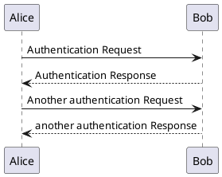

@startuml
Alice -> Bob: Authentication Request
Bob --> Alice: Authentication Response

Alice -> Bob: Another authentication Request
Alice <-- Bob: another authentication Response
@enduml

### 分類子の宣言

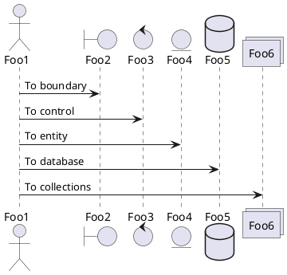

@startuml
actor Foo1
boundary Foo2
control Foo3
entity Foo4
database Foo5
collections Foo6
Foo1 -> Foo2 : To boundary
Foo1 -> Foo3 : To control
Foo1 -> Foo4 : To entity
Foo1 -> Foo5 : To database
Foo1 -> Foo6 : To collections

@enduml

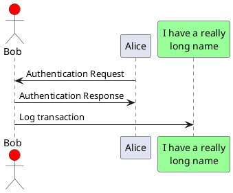

@startuml
actor Bob #red
' The only difference between actor
'and participant is the drawing
participant Alice
participant "I have a really\nlong name" as L #99FF99
/' You can also declare:
   participant L as "I have a really\nlong name"  #99FF99
  '/

Alice->Bob: Authentication Request
Bob->Alice: Authentication Response
Bob->L: Log transaction
@enduml

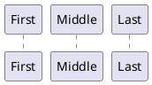

@startuml
participant Last order 30
participant Middle order 20
participant First order 10
@enduml

### 分類子名にアルファベット以外を使う

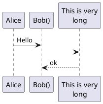

@startuml
Alice -> "Bob()" : Hello
"Bob()" -> "This is very\nlong" as Long
' You can also declare:
' "Bob()" -> Long as "This is very\nlong"
Long --> "Bob()" : ok
@enduml

### 自分自身へのメッセージ

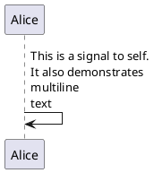

@startuml
Alice->Alice: This is a signal to self.\nIt also demonstrates\nmultiline \ntext
@enduml

### 矢印の見た目を変える

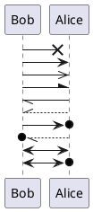

@startuml
Bob ->x Alice
Bob -> Alice
Bob ->> Alice
Bob -\ Alice
Bob \\- Alice
Bob //-- Alice

Bob ->o Alice
Bob o\\-- Alice

Bob <-> Alice
Bob <->o Alice
@enduml

### 矢印の色を替える

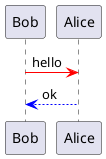

@startuml
Bob -[#red]> Alice : hello
Alice -[#0000FF]->Bob : ok
@enduml

### メッセージシーケンスの番号付け

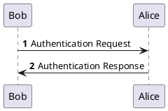

@startuml
autonumber
Bob -> Alice : Authentication Request
Bob <- Alice : Authentication Response
@enduml

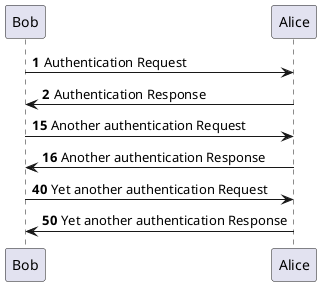

@startuml
autonumber
Bob -> Alice : Authentication Request
Bob <- Alice : Authentication Response

autonumber 15
Bob -> Alice : Another authentication Request
Bob <- Alice : Another authentication Response

autonumber 40 10
Bob -> Alice : Yet another authentication Request
Bob <- Alice : Yet another authentication Response

@enduml

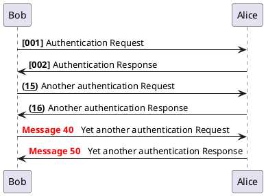

@startuml
autonumber "<b>[000]"
Bob -> Alice : Authentication Request
Bob <- Alice : Authentication Response

autonumber 15 "<b>(<u>##</u>)"
Bob -> Alice : Another authentication Request
Bob <- Alice : Another authentication Response

autonumber 40 10 "<font color=red><b>Message 0  "
Bob -> Alice : Yet another authentication Request
Bob <- Alice : Yet another authentication Response

@enduml

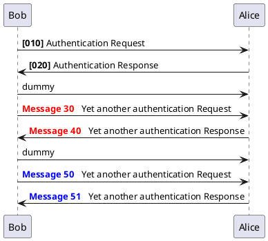

@startuml
autonumber 10 10 "<b>[000]"
Bob -> Alice : Authentication Request
Bob <- Alice : Authentication Response

autonumber stop
Bob -> Alice : dummy

autonumber resume "<font color=red><b>Message 0  "
Bob -> Alice : Yet another authentication Request
Bob <- Alice : Yet another authentication Response

autonumber stop
Bob -> Alice : dummy

autonumber resume 1 "<font color=blue><b>Message 0  "
Bob -> Alice : Yet another authentication Request
Bob <- Alice : Yet another authentication Response
@enduml

### 図の分割

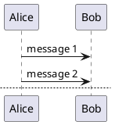

@startuml

Alice -> Bob : message 1
Alice -> Bob : message 2

newpage

Alice -> Bob : message 3
Alice -> Bob : message 4

newpage A title for the\nlast page

Alice -> Bob : message 5
Alice -> Bob : message 6
@enduml

### メッセージのグループ化
次のキーワードを使えば、メッセージをまとめてグループ化できます。

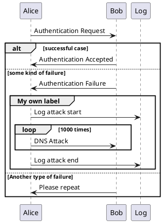

@startuml
Alice -> Bob: Authentication Request

alt successful case

	Bob -> Alice: Authentication Accepted
	
else some kind of failure

	Bob -> Alice: Authentication Failure
	group My own label
		Alice -> Log : Log attack start
	    loop 1000 times
	        Alice -> Bob: DNS Attack
	    end
		Alice -> Log : Log attack end
	end
	
else Another type of failure

   Bob -> Alice: Please repeat
   
end
@enduml

### メッセージの注釈

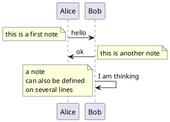

@startuml
Alice->Bob : hello
note left: this is a first note

Bob->Alice : ok
note right: this is another note

Bob->Bob : I am thinking
note left
	a note
	can also be defined
	on several lines
end note
@enduml

### その他の注釈

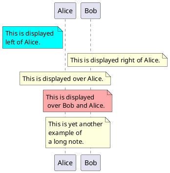

@startuml
participant Alice
participant Bob
note left of Alice #aqua
	This is displayed 
	left of Alice. 
end note
 
note right of Alice: This is displayed right of Alice.

note over Alice: This is displayed over Alice.

note over Alice, Bob #FFAAAA: This is displayed\n over Bob and Alice.

note over Bob, Alice
	This is yet another
	example of
	a long note.
end note
@enduml

### ノートの形を変える。

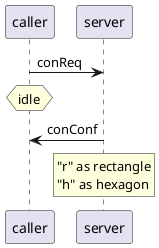

@startuml
caller -> server : conReq
hnote over caller : idle
caller <- server : conConf
rnote over server
 "r" as rectangle
 "h" as hexagon
endrnote
@enduml

### Creole と HTML

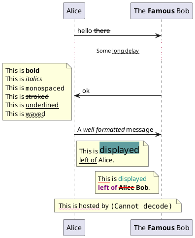

@startuml
participant Alice
participant "The **Famous** Bob" as Bob

Alice -> Bob : hello --there--
... Some ~~long delay~~ ...
Bob -> Alice : ok
note left
  This is **bold**
  This is //italics//
  This is ""monospaced""
  This is --stroked--
  This is __underlined__
  This is ~~waved~~
end note

Alice -> Bob : A //well formatted// message
note right of Alice 
 This is <back:cadetblue><size:18>displayed</size></back> 
 __left of__ Alice. 
end note
note left of Bob 
 <u:red>This</u> is <color #118888>displayed</color> 
 **<color purple>left of</color> <s:red>Alice</strike> Bob**. 
end note
note over Alice, Bob
 <w:#FF33FF>This is hosted</w> by 
end note 
@enduml

### 境界線

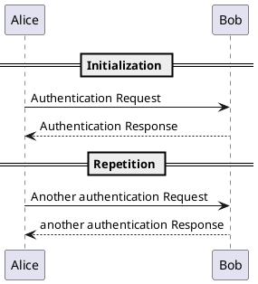

@startuml

== Initialization ==

Alice -> Bob: Authentication Request
Bob --> Alice: Authentication Response

== Repetition ==

Alice -> Bob: Another authentication Request
Alice <-- Bob: another authentication Response

@enduml

### リファレンス

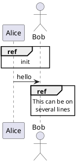

@startuml
participant Alice
actor Bob

ref over Alice, Bob : init

Alice -> Bob : hello

ref over Bob
  This can be on
  several lines
end ref
@enduml

### 遅延

```plantuml
@startuml

Alice -> Bob: Authentication Request
...
Bob --> Alice: Authentication Response
...5 minutes latter...
Bob --> Alice: Bye !

@enduml
```

@startuml

Alice -> Bob: Authentication Request
...
Bob --> Alice: Authentication Response
...5 minutes latter...
Bob --> Alice: Bye !

@enduml

### 間隔

```plantuml
@startuml

Alice -> Bob: message 1
Bob --> Alice: ok
|||
Alice -> Bob: message 2
Bob --> Alice: ok
||45||
Alice -> Bob: message 3
Bob --> Alice: ok

@enduml
```

@startuml

Alice -> Bob: message 1
Bob --> Alice: ok
|||
Alice -> Bob: message 2
Bob --> Alice: ok
||45||
Alice -> Bob: message 3
Bob --> Alice: ok

@enduml

### ライフラインの活性化と破壊

```plantuml
@startuml
participant User

User -> A: DoWork
activate A

A -> B: << createRequest >>
activate B

B -> C: DoWork
activate C
C --> B: WorkDone
destroy C

B --> A: RequestCreated
deactivate B

A -> User: Done
deactivate A

@enduml
```

@startuml
participant User

User -> A: DoWork
activate A

A -> B: << createRequest >>
activate B

B -> C: DoWork
activate C
C --> B: WorkDone
destroy C

B --> A: RequestCreated
deactivate B

A -> User: Done
deactivate A

@enduml

```plantuml
@startuml
participant User

User -> A: DoWork
activate A #FFBBBB

A -> A: Internal call
activate A #DarkSalmon

A -> B: << createRequest >>
activate B

B --> A: RequestCreated
deactivate B
deactivate A
A -> User: Done
deactivate A

@enduml
```

@startuml
participant User

User -> A: DoWork
activate A #FFBBBB

A -> A: Internal call
activate A #DarkSalmon

A -> B: << createRequest >>
activate B

B --> A: RequestCreated
deactivate B
deactivate A
A -> User: Done
deactivate A

@enduml

### 分類子の生成

```plantuml
@startuml
Bob -> Alice : hello

create Other
Alice -> Other : new

create control String
Alice -> String
note right : You can also put notes!

Alice --> Bob : ok

@enduml
```

@startuml
Bob -> Alice : hello

create Other
Alice -> Other : new

create control String
Alice -> String
note right : You can also put notes!

Alice --> Bob : ok

@enduml

### インとアウトのメッセージ

```plantuml
@startuml
[-> A: DoWork

activate A

A -> A: Internal call
activate A

A ->] : << createRequest >>

A<--] : RequestCreated
deactivate A
[<- A: Done
deactivate A
@enduml
```

@startuml
[-> A: DoWork

activate A

A -> A: Internal call
activate A

A ->] : << createRequest >>

A<--] : RequestCreated
deactivate A
[<- A: Done
deactivate A
@enduml

```plantuml
@startuml
[-> Bob
[o-> Bob
[o->o Bob
[x-> Bob

[<- Bob
[x<- Bob

Bob ->]
Bob ->o]
Bob o->o]
Bob ->x]

Bob <-]
Bob x<-]
@enduml
```

@startuml
[-> Bob
[o-> Bob
[o->o Bob
[x-> Bob

[<- Bob
[x<- Bob

Bob ->]
Bob ->o]
Bob o->o]
Bob ->x]

Bob <-]
Bob x<-]
@enduml

### ステレオタイプとスポット

```plantuml
@startuml

participant "Famous Bob" as Bob << Generated >>
participant Alice << (C,#ADD1B2) Testable >>

Bob->Alice: First message

@enduml
```

@startuml

participant "Famous Bob" as Bob << Generated >>
participant Alice << (C,#ADD1B2) Testable >>

Bob->Alice: First message

@enduml

```plantuml
@startuml

skinparam guillemet false
participant "Famous Bob" as Bob << Generated >>
participant Alice << (C,#ADD1B2) Testable >>

Bob->Alice: First message

@enduml
```

@startuml

skinparam guillemet false
participant "Famous Bob" as Bob << Generated >>
participant Alice << (C,#ADD1B2) Testable >>

Bob->Alice: First message

@enduml

```plantuml
@startuml

participant Bob << (C,#ADD1B2) >>
participant Alice << (C,#ADD1B2) >>

Bob->Alice: First message

@enduml
```

@startuml

participant Bob << (C,#ADD1B2) >>
participant Alice << (C,#ADD1B2) >>

Bob->Alice: First message

@enduml

### タイトルについての詳細

```plantuml
@startuml

title __Simple__ **communication** example

Alice -> Bob: Authentication Request
Bob -> Alice: Authentication Response

@enduml
```

@startuml

title __Simple__ **communication** example

Alice -> Bob: Authentication Request
Bob -> Alice: Authentication Response

@enduml

```plantuml
@startuml

title __Simple__ communication example\non several lines

Alice -> Bob: Authentication Request
Bob -> Alice: Authentication Response

@enduml
```

@startuml

title __Simple__ communication example\non several lines

Alice -> Bob: Authentication Request
Bob -> Alice: Authentication Response

@enduml

```plantuml
@startuml

title
 <u>Simple</u> communication example
 on <i>several</i> lines and using <font color=red>html</font>
 This is hosted by 
end title

Alice -> Bob: Authentication Request
Bob -> Alice: Authentication Response

@enduml
```

@startuml

title
 <u>Simple</u> communication example
 on <i>several</i> lines and using <font color=red>html</font>
 This is hosted by 
end title

Alice -> Bob: Authentication Request
Bob -> Alice: Authentication Response

@enduml

### 分類子の囲み

```plantuml
@startuml

box "Internal Service" #LightBlue
	participant Bob
	participant Alice
end box
participant Other

Bob -> Alice : hello
Alice -> Other : hello

@enduml
```

@startuml

box "Internal Service" #LightBlue
	participant Bob
	participant Alice
end box
participant Other

Bob -> Alice : hello
Alice -> Other : hello

@enduml

### フッターの除去

```plantuml
@startuml

hide footbox
title Footer removed

Alice -> Bob: Authentication Request
Bob --> Alice: Authentication Response

@enduml
```

@startuml

hide footbox
title Footer removed

Alice -> Bob: Authentication Request
Bob --> Alice: Authentication Response

@enduml

### スキンパラメータ

```plantuml
@startuml
skinparam sequenceArrowThickness 2
skinparam roundcorner 20
skinparam maxmessagesize 60
skinparam sequenceParticipant underline

actor User
participant "First Class" as A
participant "Second Class" as B
participant "Last Class" as C

User -> A: DoWork
activate A

A -> B: Create Request
activate B

B -> C: DoWork
activate C
C --> B: WorkDone
destroy C

B --> A: Request Created
deactivate B

A --> User: Done
deactivate A

@enduml
```

@startuml
skinparam sequenceArrowThickness 2
skinparam roundcorner 20
skinparam maxmessagesize 60
skinparam sequenceParticipant underline

actor User
participant "First Class" as A
participant "Second Class" as B
participant "Last Class" as C

User -> A: DoWork
activate A

A -> B: Create Request
activate B

B -> C: DoWork
activate C
C --> B: WorkDone
destroy C

B --> A: Request Created
deactivate B

A --> User: Done
deactivate A

@enduml

```plantuml
@startuml
skinparam backgroundColor #EEEBDC
skinparam handwritten true

skinparam sequence {
	ArrowColor DeepSkyBlue
	ActorBorderColor DeepSkyBlue
	LifeLineBorderColor blue
	LifeLineBackgroundColor #A9DCDF
	
	ParticipantBorderColor DeepSkyBlue
	ParticipantBackgroundColor DodgerBlue
	ParticipantFontName Impact
	ParticipantFontSize 17
	ParticipantFontColor #A9DCDF
	
	ActorBackgroundColor aqua
	ActorFontColor DeepSkyBlue
	ActorFontSize 17
	ActorFontName Aapex
}

actor User
participant "First Class" as A
participant "Second Class" as B
participant "Last Class" as C

User -> A: DoWork
activate A

A -> B: Create Request
activate B

B -> C: DoWork
activate C
C --> B: WorkDone
destroy C

B --> A: Request Created
deactivate B

A --> User: Done
deactivate A

@enduml
```

@startuml
skinparam backgroundColor #EEEBDC
skinparam handwritten true

skinparam sequence {
	ArrowColor DeepSkyBlue
	ActorBorderColor DeepSkyBlue
	LifeLineBorderColor blue
	LifeLineBackgroundColor #A9DCDF
	
	ParticipantBorderColor DeepSkyBlue
	ParticipantBackgroundColor DodgerBlue
	ParticipantFontName Impact
	ParticipantFontSize 17
	ParticipantFontColor #A9DCDF
	
	ActorBackgroundColor aqua
	ActorFontColor DeepSkyBlue
	ActorFontSize 17
	ActorFontName Aapex
}

actor User
participant "First Class" as A
participant "Second Class" as B
participant "Last Class" as C

User -> A: DoWork
activate A

A -> B: Create Request
activate B

B -> C: DoWork
activate C
C --> B: WorkDone
destroy C

B --> A: Request Created
deactivate B

A --> User: Done
deactivate A

@enduml

### パディングの変更

```plantuml
@startuml
skinparam ParticipantPadding 20
skinparam BoxPadding 10

box "Foo1"
participant Alice1
participant Alice2
end box
box "Foo2"
participant Bob1
participant Bob2
end box
Alice1 -> Bob1 : hello
Alice1 -> Out : out
@enduml
```

@startuml
skinparam ParticipantPadding 20
skinparam BoxPadding 10

box "Foo1"
participant Alice1
participant Alice2
end box
box "Foo2"
participant Bob1
participant Bob2
end box
Alice1 -> Bob1 : hello
Alice1 -> Out : out
@enduml
