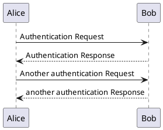
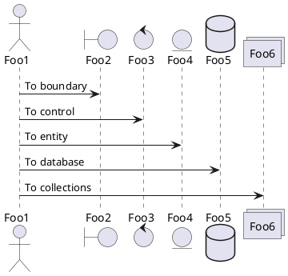
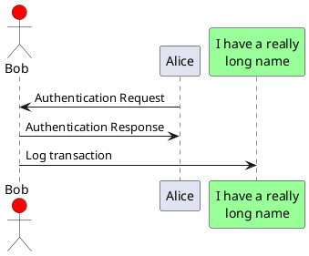

# plantuml demo

<!--[NOWRITING]-->
<link rel="canonical" href="https://wraith13.github.io/writing/?@demo/plantuml.md" />
この markdown の表示用URL: <a rel="canonical" href="https://wraith13.github.io/writing/?@demo/plantuml.md">https://wraith13.github.io/writing/?@demo/plantuml.md</a>
<!--[/NOWRITING]-->

<!--[WRTING-CONFING]
{
    "renderer": "markdown-it"
}
-->

[こちらのサイト](http://plantuml.com/)の[このページ](http://plantuml.com/sequence-diagram)のサンプルの極一部の焼き直しになります。本家のページには解説もあれば、もっと豊富に様々なサンプルがあるので、リファレンスとしてはそちらを参照してください。( この markdown は [writing](https://github.com/wraith13/writing) としての demo に過ぎません。 )

## シーケンス図

### 基本的な例

@startuml
Alice -> Bob: Authentication Request
Bob --> Alice: Authentication Response

Alice -> Bob: Another authentication Request
Alice <-- Bob: another authentication Response
@enduml

### 分類子の宣言

@startuml
actor Foo1
boundary Foo2
control Foo3
entity Foo4
database Foo5
collections Foo6
Foo1 -> Foo2 : To boundary
Foo1 -> Foo3 : To control
Foo1 -> Foo4 : To entity
Foo1 -> Foo5 : To database
Foo1 -> Foo6 : To collections

@enduml

@startuml
actor Bob #red
' The only difference between actor
'and participant is the drawing
participant Alice
participant "I have a really\nlong name" as L #99FF99
/' You can also declare:
   participant L as "I have a really\nlong name"  #99FF99
  '/

Alice->Bob: Authentication Request
Bob->Alice: Authentication Response
Bob->L: Log transaction
@enduml
