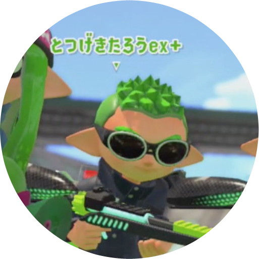

<!--[NOWRITING]-->
<link rel="canonical" href="https://wraith13.github.io/writing/?splatoon2/totsugekitarouexp.md" />
この markdown の表示用URL: <a rel="canonical" href="https://wraith13.github.io/writing/?splatoon2/totsugekitarouexp.md">https://wraith13.github.io/writing/?splatoon2/totsugekitarouexp.md</a>
<!--[/NOWRITING]-->
<!--[AUTOPAGESEPARATE] true -->
<!--[WRTING-CONFING]
{
    "referrer_option": true,
    "renderer": "reveal",
    "favicon": "totsugekitarouexp.rounded.png"
}
-->
<!--[REVEAL-THEME] BLACK -->
<!--[REVEAL-TRANSITION] CONCAVE -->

# とつげきたろうex+

<!--[REMARK-CONFIG]
{
    "ratio": "16:9"
}
-->
<!--[REMARK]-->
<!--[THEME] ../theme/chocolate.css -->
<!--[THEME] ../animation/fade.css -->
<!--[/REMARK]-->

<!--[WRITING/][markdown](?markdown) | [remark](?remark) | [reveal](?reveal)-->

## このドキュメントについて

スプラトゥーンに関するプレイ指南のような類いの情報を書き記すにあたって「これ、どういう人が書いてんの？」って参考情報としてあった方が望ましいと思い、私のスプラトゥーンプレイヤーとして情報をここに簡単にまとめておきます。

## 動機

別に自分はスプラトゥーンのトップレベルのプレイヤーってわけでもなくプレイ指南のような類いの情報を書き記すのはおこがましいかと思ってたんですが、自分がこれぐらい常識だろって思うようなことを知らないプレイヤーもとても多いということに気付いて書くだけは書き出しておくことにしました。

## プレイ記録

1は途中からですが、2では全マッチのプレイ結果を記録するようにしてます。プレイ動画も全マッチ録画するようにしてますが流石にデータ量が嵩張るので古いヤツは適宜削除してます。

## 録画環境

- キャプチャハード: [AVerMedia AVT-C878](https://www.avermedia.co.jp/product_swap/avt-c878.html)
- PC本体: MacBook Pro (初代 Retinaディスプレイモデル)
- 録画ソフトウェア: QuickTime Player

<!--[REVEAL/] *(↓下方向に続きがあります)* -->

<!--[NOMD/]>>>-->

> Nintentdo Switch 本体にも動画の録画機能が実装されましたが画質がちょっと残念なのとプレイ中に録画操作に意識を取られるのはよろしくないのでできれば別途録画設備を整えたほうがいいです。

> 私は AVerMedia AVT-C878 にしましたが、 [AVerMedia AVT-C875](https://www.avermedia.co.jp/product_swap/avt-c875.html) も利用者が多くオススメです。

## プレイ環境

19インチディスプレイ＋ヘッドホン

> デカいモニターに繋いだ方が迫力は増すんですが、反面、3D酔いしやすくなる上に画面全体の情報も把握し難くなって不利になるので小さめのモニターを好んで利用してます。

## 2での使用コントローラー

Joy-Con ( + Joy-Con 充電グリップ )

> 昔から Nintendo Switch Proコントローラー のような形状のコントローラーがどうにも自分には合わないので Joy-Con を愛用してます。

## 操作設定

- ジャイロ操作感度: 5(MAX)
- Rスティック操作感度: 5(MAX)
- Rスティック左右操作: リバース
- ジャイロ操作: ON
- 色覚サポート: OFF
- 投稿の表示: 表示ON

## プレイルール

基本的に野良ガチばかりやってます。

## 1での持ちブキ＆ウデマエ

- シャープマーカーでS+

## 2での持ちブキ

- ヒーローチャージャー レプリカ(スプラチャージャー)
- ~~シャープマーカーネオ~~ (封印中)

## 2でのウデマエ

<!--[NOWRITING/]
2018年3月現在

- ガチエリア: 最高 S+1 で S にいることが大半
- ガチヤグラ: 最高 S+4 で S+ で安定
- ガチホコ: 最高 S+1 で S にいることが大半
- ガチアサリ: 最高 S で A+ にいることが大半
-->

2018年4月現在

- ガチエリア: 最高 S+1 で S にいることが大半
- ガチヤグラ: 最高 S+4 で比較的 S+ で安定
- ガチホコ: 最高 S+1 で S にいることが大半
- ガチアサリ: 最高 S+0 で S にいることが大半

## 持ちブキのコンバートについて

2のシャープマーカーのサブとスペシャルが望んでたモノと全然違ったってのと、チャージャー系は後から使おうと思ってもとてもガチマッチに担いで行ってなかなかまともに使えるブキではないので2では最初はまずチャージャーを使いこなしておこうと思って使ってたんですが、そのまますっかりヒーローチャージャー レプリカ(スプラチャージャー)使いとして定着し、全ルールで S+ 到達しました。

## 2018-04-25 ver 3.0.0

ver 3.0.0 のアップデートとともに前作のシャープマーカーに近いシャープマーカーネオが解禁され、これだ！となったところなんですが、同時にウデマエ X も解禁されたのでウデマエ X 到達まで封印することにしました。

> フェスなんかではシャープマーカーネオをメインで使用する予定です。

## お気に入りのギア装備

- ダブルエッグサングラス(ゲソタウン版イカダッシュ速度アップver)
- キングベンチNV
- エンペリアルNV

## プレイ動画

[プレイ動画セレクション](totsugekitarouexp.playmovie.md)

## その他

スプラトゥーン以外のゲームもやらなくはないですが、ガッツリやりこんでるのはスプラトゥーンぐらいで基本的にライトゲーマーって感じです。

仕事でも趣味でもプログラミングやってます。

- twitter: [@wraith13](https://twitter.com/wraith13)
- github: [wraith13](https://github.com/wraith13)

## end of document

<!--[NOWRITING/]
- [次のドキュメント(始めに)](introduction.md)
-->
- 次のドキュメント(準備中)
- [一覧へ戻る](index.md)
